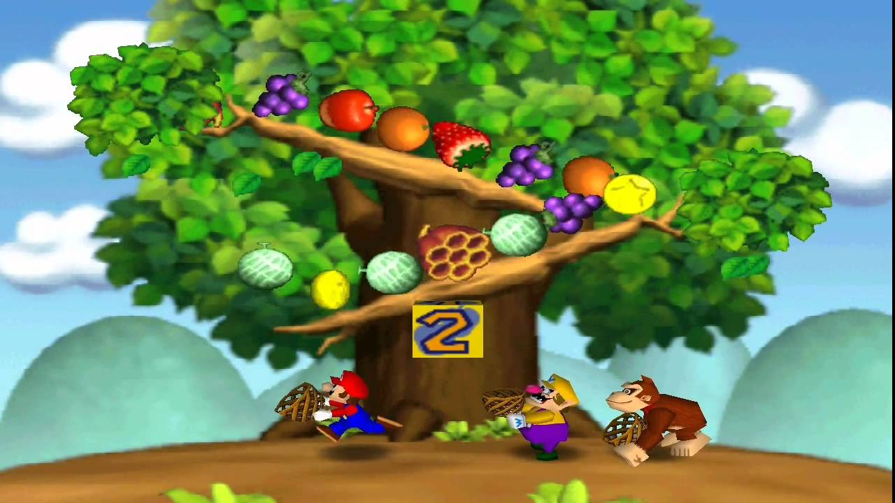

# Double Trouble

This game called "Double Trouble" consists of

- Three (3) green buttons
- Seven (7) yellow buttons
- Five (5) orange buttons

Two players take turns clicking (and therefore disabling) as many buttons of a single color as they wish.
The player who removes the last button wins!

## History

The game we call "Double Trouble" is really a particular instantiation of the
game [NIMS](https://en.wikipedia.org/wiki/Nim).
The original origins of the game is unknown but the modern interpretation of the game can be traced back to 16th century
in Europe.
The current name NIM was coined by Charles L. Bouton of Harvard University. Charles who also was the first to solve the
game in 1901

## Modern Appearances

The game of NIM reminds me of *Honeycomb Havoc* in Mario party 2. In the game players jump to hit a block that chooses 1
or 2 items (fruits/coins). Similar to the game NIM, you want to leave the game state balanced to avoid taking a
honeycomb (which gets you stung by bees). In HH, the optimal strategy is to leave items in multiples of three so you can
always take another item and not be forced to take the honeycomb.

## How To Run
**Requirements:** JDK 21+
```bash
git clone https://github.com/noahheller/DoubleTrouble.git
cd DoubleTrouble
```
### Mac/Linux
`./mvnw javafx:run`
### Windows
`mvnw.cmd javafx:run`